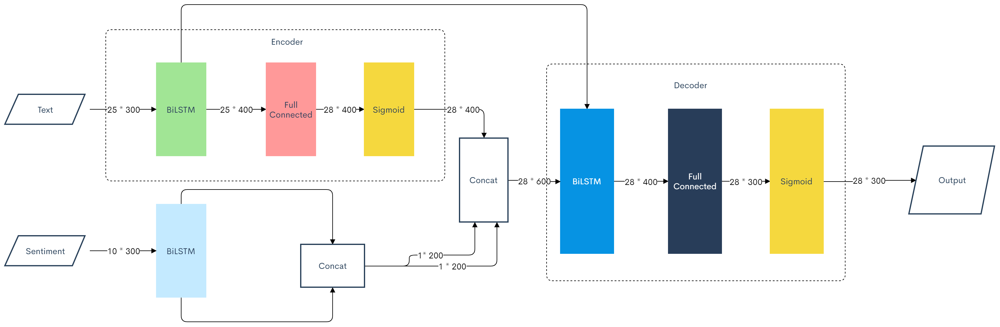

# Vietnamese Poem Generator with seq2seq

## Idea

- input text
- input sentiment
- output

## Progress

- [x] idea.
- [x] data preparation.
- [ ] model training:

  - [x] training with generator.
  - [ ] add discriminator.

- [ ] evaluation.
- [ ] model improvement.
- [x] frontend.

## Requirements

- python 3.x
- torch, torchvision
- spacy, pyvi, underthesea for vietnamese processing in data preparation.

## Data preparation

## Model training

### Generator

- **Criterion:** MSELoss
- **Optimizer:** Adam

**Stage 1:** Train without discrimination use pre-trained word2vec

- Use pre-trained word embedding model fasttext and baomoi
-> **Fail**

**Stage 2:** Train without discrimination and pre-trained word2vec

- train uni-gram pytorch embedding

### Discriminator

## Evaluating

## Contributor
