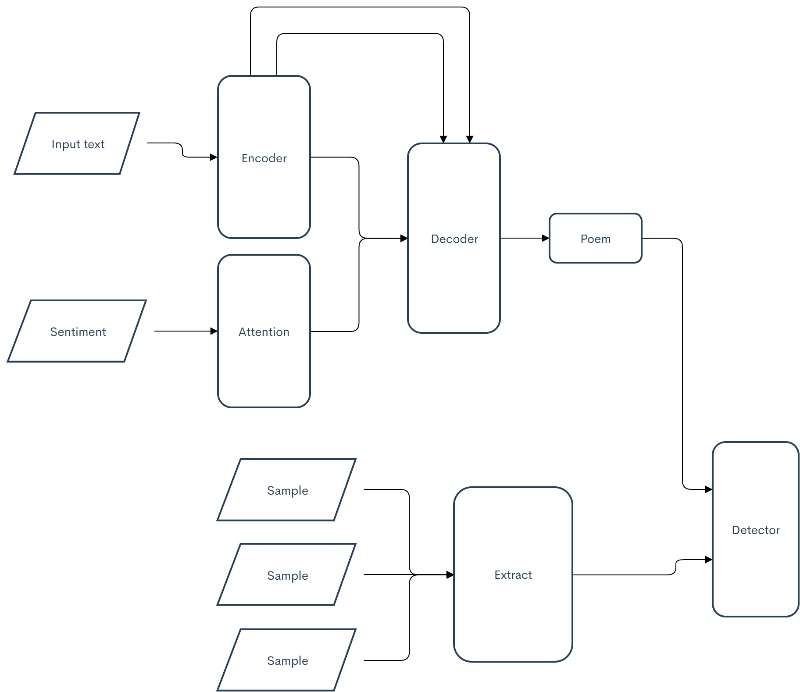
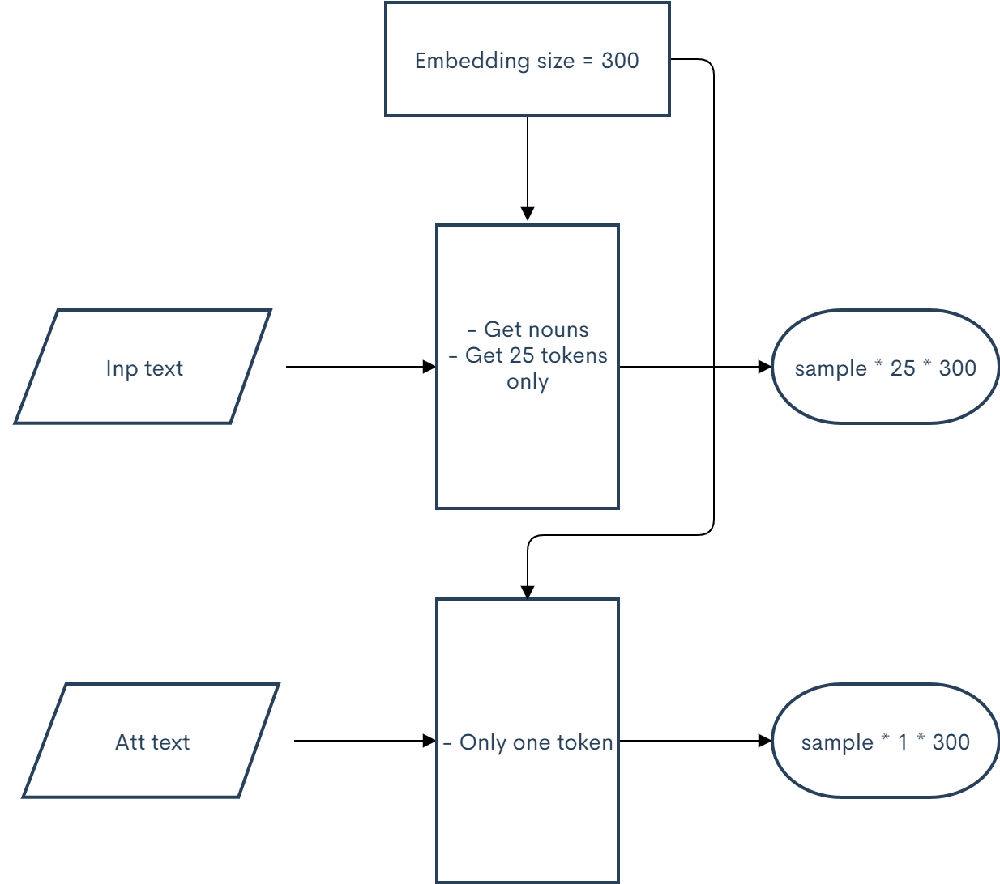

# Vietnamese Poem Generator with seq2seq

## Idea

- input text
- input sentiment
- output

## Progress

- [x] idea.
- [x] data preparation.
- [ ] model training.
- [ ] evaluation.
- [ ] model improvement.
- [ ] frontend.

## Requirements
- python 3.x
- torch, torchvision
- spacy, pyvi, underthesea for vietnamese processing

## Data preparation

## Model training

## Evaluating

## Contributor
